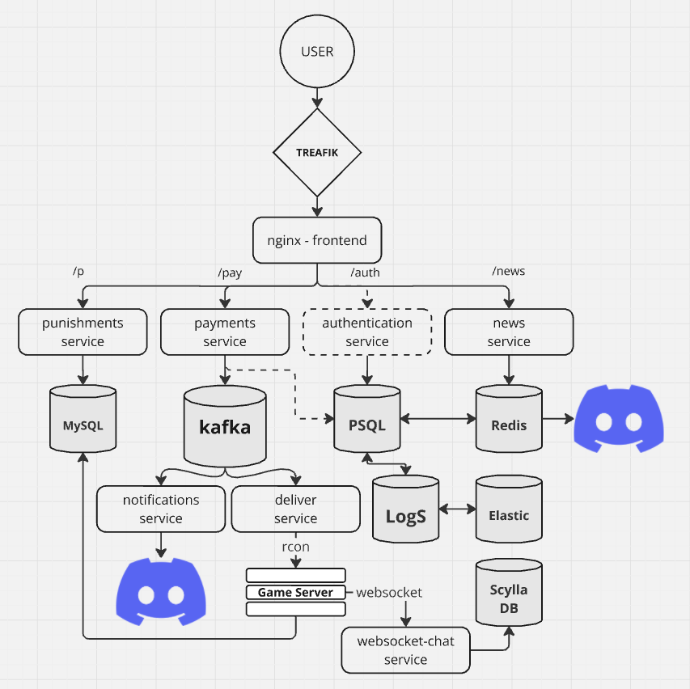

### Сайт игрового сервера

Этот сайт позволяет приобретать различные привилегии для игрового сервера, 
а также просматривать список наказаний (баны, муты, предупреждения). В планах реализовать сервис для просмотра внутриигровой статистики прямо на сайте.

Ключевые технологии: Микросервесная архитектура, React, Kafka, Docker-Compose.

### Дизайн системы: 

### Ссылки на Backend Сервисы:
- Сервис доставки услуг: https://github.com/Yacheru/deliver-service
- Сервис просмотра игровых наказаний: https://github.com/Yacheru/punishments-service
- Сервис новостей: https://github.com/Yacheru/news-service (WIP)
- Сервис обработки платежей: https://github.com/Yacheru/payments-service
- Сервис уведомлений о покупках: https://github.com/Yacheru/notifications-service
