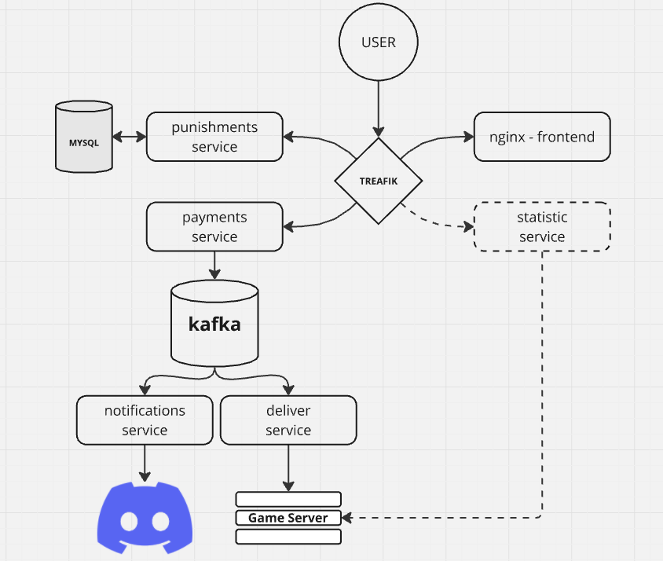

### Сайт игрового сервера

Этот сайт позволяет приобретать различные привилегии для игрового сервера, 
а также просматривать список наказаний (баны, муты, предупреждения). В планах реализовать сервис для просмотра внутриигровой статистики прямо на сайте.

Ключевые технологии: Микросервесная архитектура, React, Kafka, Docker-Compose.

### Дизайн системы: 

